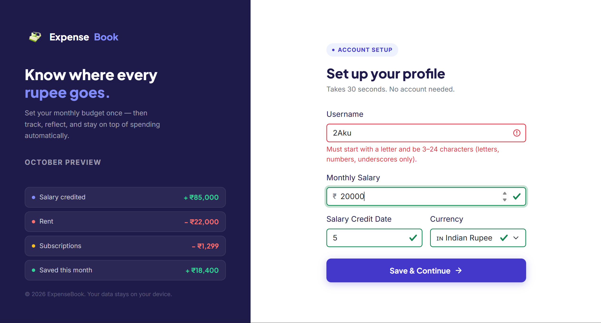
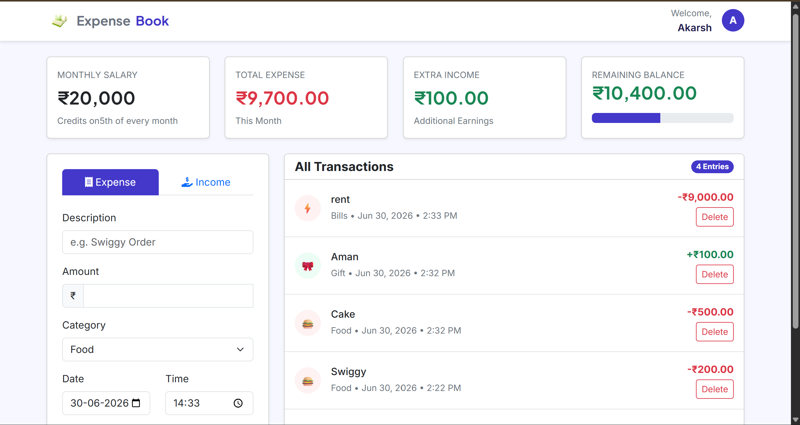

# 💰 ExpenseBook

ExpenseBook is a responsive personal expense tracker built using **HTML, CSS, Bootstrap, and JavaScript**. It helps users manage their monthly budget by tracking expenses, recording additional income, and monitoring the remaining balance. All data is stored locally using **Local Storage**, so no account or database is required.

---

## ✨ Features

- 👤 Profile setup with username, salary, currency, and salary credit date
- 💸 Add and manage expenses
- 💰 Record additional income
- 📊 Dashboard displaying:
  - Monthly Salary
  - Total Expenses
  - Extra Income
  - Remaining Balance
- 📅 Date and time for every transaction
- 📜 Scrollable transaction history
- 🗑️ Delete transactions
- 💾 Local Storage support (data persists after refreshing)
- 📱 Responsive design using Bootstrap 5

---

## 🛠️ Technologies Used

- HTML5
- CSS3
- Bootstrap 5
- JavaScript (ES6)
- Local Storage API
- Font Awesome

---

## 📁 Project Structure

```
ExpenseBook/
│
├── css/
│   ├── style.css
│   └── dashboard.css
│
├── js/
│   ├── script.js
│   └── dashboard.js
│
├── images/
│
├── index.html
├── Dashboard.html
└── README.md
```

---

## 📷 Screenshots

### Setup Page




---

### Dashboard



---

## 🚀 How to Run

1. Clone the repository

```bash
git clone https://github.com/your-username/ExpenseBook.git
```

2. Open the project folder.

3. Open **index.html** in your browser.

No installation or server is required.

---

## 💡 Future Improvements

- Monthly expense analytics
- Charts and graphs
- Dark mode
- Expense filtering
- Search transactions
- Export data (CSV/PDF)
- Edit existing transactions
- Multiple user support

---

## 📄 License

This project is created for learning and portfolio purposes.

---

## 👨‍💻 Author
**Akarsh Kumar**
💻 Aspiring Full-Stack Web Developer with a strong interest in Frontend Development and UI Design. 🚀
